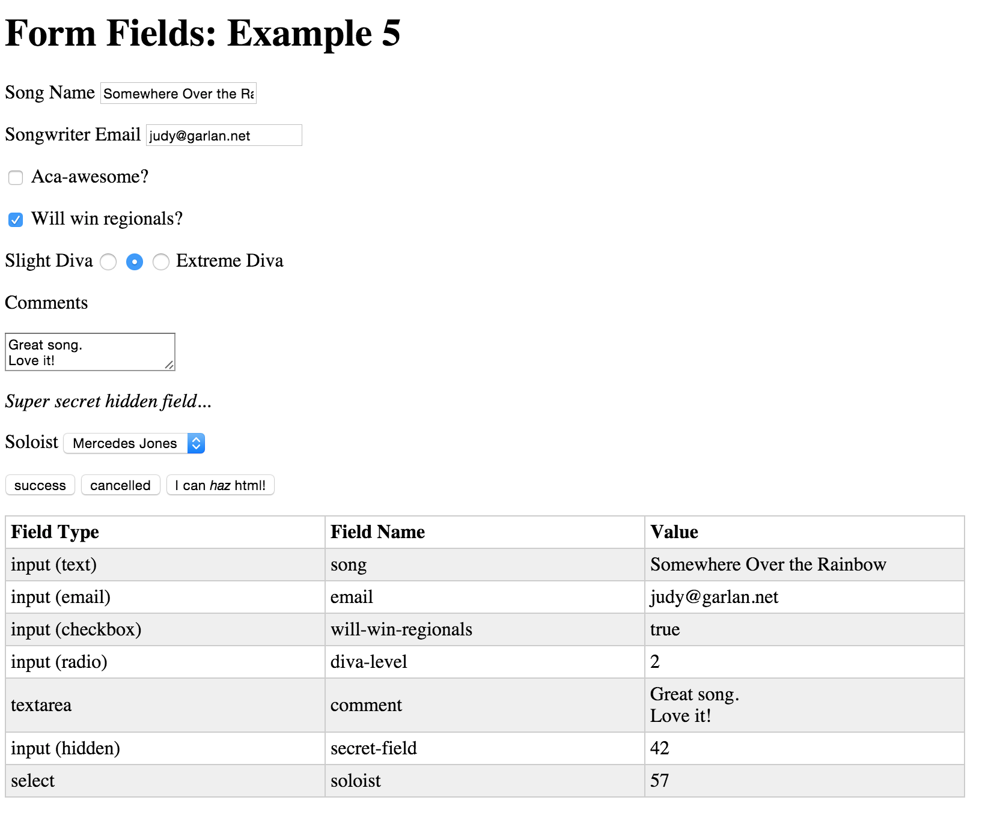

# HTML forms and form elements

## Setup

* Fork
* Clone
* CD into the directory
* Run `open index.html`

When you add HTML elements to the forms, and click the button, you will see a table of types / names / values appear below.  This is how you'll know you did it correctly.

## Resources

* http://www.w3.org/TR/html401/interact/forms.html
* https://developer.mozilla.org/en-US/docs/Web/Guide/HTML/Forms/My_first_HTML_form
* https://developer.mozilla.org/en-US/docs/Web/Guide/HTML/Forms
* https://developer.mozilla.org/en-US/docs/Web/HTML/Element/Input
* http://diveintohtml5.info/forms.html

## Challenge #1

Inside the form in `index.html` add some fields:

* add two inputs with the type "text"
  * give one a value
* add two textareas
  * give one some pre-filled text
* add an input of type "email"
* add an input of type "date"
* add an input of type "number"
* add an input of type "file"
* add unique names and ids to each
* for each input and textarea, add a label with a `for` attribute that matches
* add a submit button (input with a type of submit)

## Challenge #2

* in the `example_03.html` file add a form
  - set the method and action to send a get request to the `example_03.html` page
* add 2 hidden fields, give each a unique name and value
* add three inputs with the type "checkbox"
* wrap each checkbox in a label with some text
* make one checkbox checked by default when you load the page
* make one checkbox have the same name as a hidden field
* add a submit button (a button with a type of submit)

## Challenge #3

* in the `example_03.html` file add a form
  - set the method and action to send a get request to the `example_03.html` page
* add two sets of radio buttons
* for each set:
  * wrap all the radio buttons in a fieldset
  * give each radio button the same name
  * give each radio button a unique id
  * wrap each radio button in a label with some text
* in the first set
  * make one radio button checked by default

## Challenge #4

* in the `example_04.html` file add a form
  - set the method and action to send a get request to the `example_04.html` page
* add 4 select boxes with options
* in the first
  * add options with values and text
  * make one of them selected by default when the page loads
* in the second, add options with just text
* in the third, add some options with blank values
* make the 4th a multi-select box
* add labels for all

Extra:

* add optgroups with labels to group options (http://www.w3.org/TR/html401/interact/forms.html#h-17.6)

## Challenge #5

Make a form that looks like this:

## Challenge #6

* Add a few form fields
* Submit the form (this one makes a GET request)
* Change the action on the form and submit
